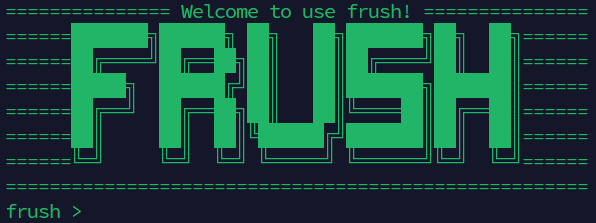

# frush

<p align="center">
<br/>
<a href="https://github.com/free-ran-ue/frush/releases"></a>
<a href="https://github.com/free-ran-ue/frush/blob/main/LICENSE"></a>
<a href="https://www.codefactor.io/repository/github/free-ran-ue/frush"></a>
<a href="https://goreportcard.com/badge/github.com/free-ran-ue/frush"></a>
</p>

frush (free-ran-ue + shell) is a Bash-like interactive shell that provides a convenient interface for operating free-ran-ue and validating 5G core network, free5GC, behavior.

## free5GC Setting

Set N3 IP in `smfcfg.yaml` and `upfcfg.yaml` as `127.0.0.1`.

(Only these two fields shoud be modified!)

## Build frush

frush is developed under `go version go1.25.5 linux/amd64`. So make sure your environment has already installed go.

### Clone

```bash
git clone https://github.com/free-ran-ue/frush
```

### Make

```bash
cd frush
make
```

## Run frush

```bash
sudo ./frush
```

| frush CMD | Args | Description |
| - | - | - |
| help | - | Show help |
| exit | - | Exit |
| add | - | Add a subscriber to free5GC's webconsole |
| delete | - | Delete a subscriber from free5GC's webconsole |
| status | - | Show the status of gNB and UE |
| gnb | - | Start gNB |
| stop | - | Stop gNB (will also de-register UE if registered) |
| reg | - | Register UE to free5GC |
| dereg | - | De-register UE |
| ping | {IP} | Ping the DN, if dn is not provided, ping 1.1.1.1 and 8.8.8.8 |
